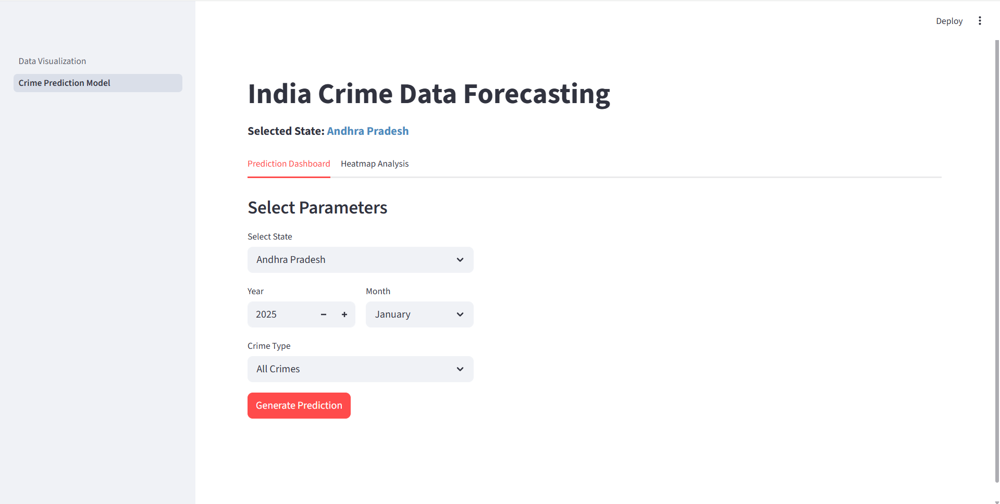
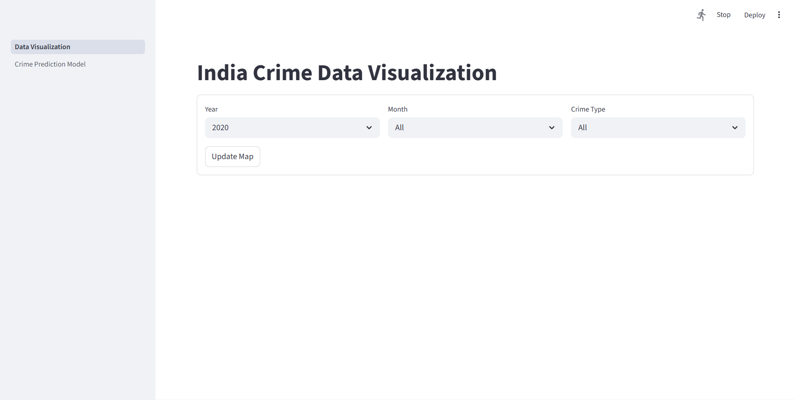
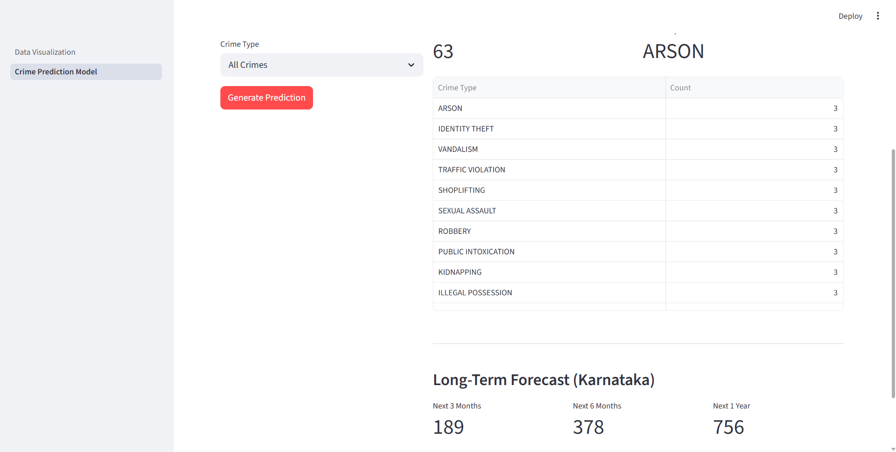
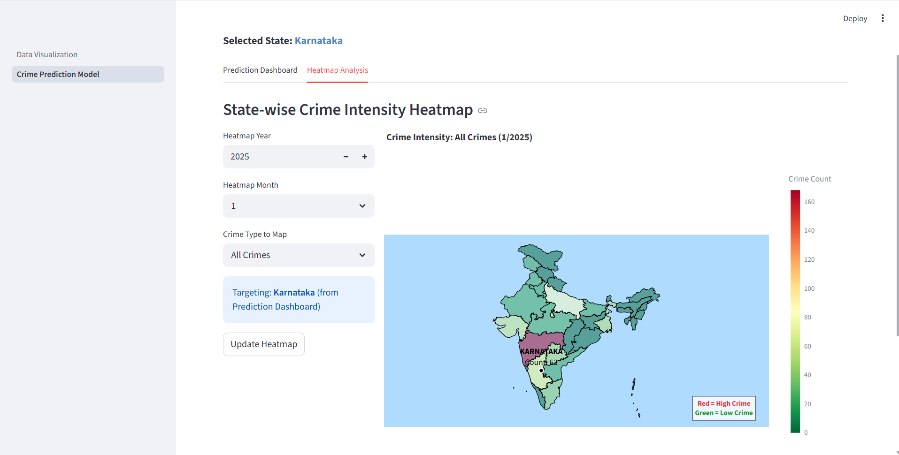
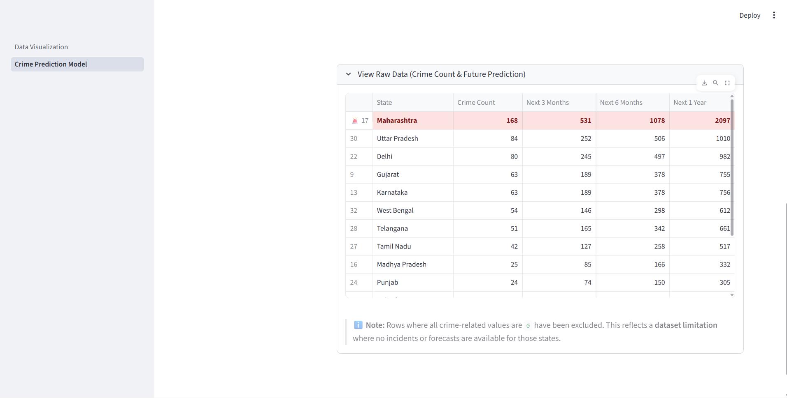
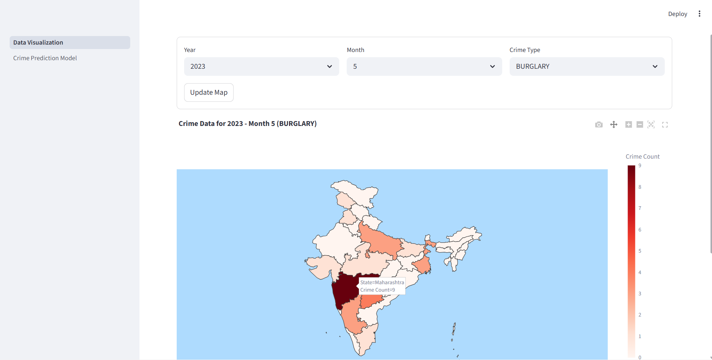
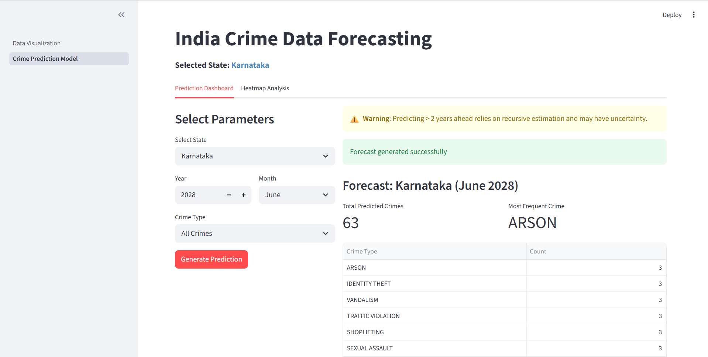
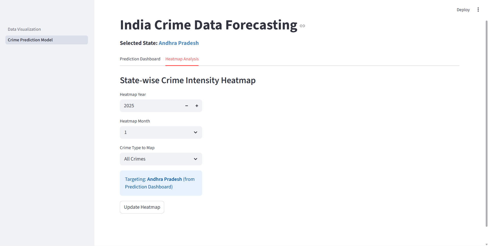

# Crime Data Forecasting & Hotspot Detection

A machine learning and data analytics application that analyzes historical crime data in India, forecasts future crime trends, and visualizes crime patterns and potential hotspots.

The project uses **Recursive Support Vector Regression (SVR)** to forecast crime trends for the years **2024–2030** and provides interactive visualizations through a **Streamlit dashboard**.

---

## Demo

🎥 **Project Demo:** Coming soon.

> A live Streamlit deployment link will be added once the dashboard is publicly hosted.

---

## Table of Contents

- [Business Understanding](#business-understanding)
- [Data Understanding](#data-understanding)
- [Data Processing](#data-processing)
- [Forecasting and Modeling](#forecasting-and-modeling)
- [Screenshots of Visualizations/Results](#screenshots-of-visualizationsresults)
- [Technologies](#technologies)
- [Project Structure](#project-structure)
- [Setup](#setup)
- [Approach](#approach)
- [Forecasting Limitations](#forecasting-limitations)
- [Status](#status)
- [Credits](#credits)
- [Author](#author)

---

## Business Understanding

### Objective

The objective of this project is to develop a machine learning and data analytics application that analyzes historical crime data in India, forecasts future crime trends, and provides interactive visualizations of crime patterns and potential hotspots.

The application is designed to:

- Analyze historical crime trends in India.
- Understand state-wise and category-wise crime patterns.
- Forecast future crime trends using machine learning.
- Identify areas with potentially higher crime activity.
- Visualize historical and predicted crime patterns.
- Provide an interactive dashboard for exploring crime data and predictions.

### Motivation

Crime analysis can help identify historical patterns and changing trends across different states and crime categories.

This project combines **data analytics, machine learning, forecasting, geographical visualization, and interactive dashboards** into a single application for exploring historical crime information and future crime predictions.

The project uses **Support Vector Regression (SVR)** with historical crime data and lag features to generate future predictions.

### Challenges

The main challenges encountered during development included:

- Cleaning and standardizing crime data.
- Preparing historical crime records for machine learning.
- Handling categorical variables such as states and crime categories.
- Creating lag features for forecasting.
- Training the SVR forecasting model.
- Generating recursive future predictions.
- Combining prediction results with geographical data.
- Creating interactive geographical visualizations.
- Communicating the uncertainty of long-term forecasts.

---

## Data Understanding

The project uses historical crime data from India, including data sourced from the **Indian Crimes Dataset** and NCRB-related crime statistics.

### Dataset

The primary dataset used in the project is:

**Indian Crimes Dataset**

Source:

- [Kaggle – Indian Crimes Dataset](https://www.kaggle.com/datasets/sudhanvahg/indian-crimes-dataset)

The model is trained using historical data from **2020–2023**.

### Data Characteristics

The data is used to analyze:

- Crime trends over time.
- State-wise crime patterns.
- Crime categories.
- Historical crime values.
- Future crime trends.

### Geographical Data

The project also uses Indian state-level GeoJSON data to create geographical crime visualizations and maps.

Sources include:

- [GeoJSON – geohacker/india](https://github.com/geohacker/india/blob/master/state/india_state.geojson)
- [GeoJSON – udit-001/india-maps-data](https://github.com/udit-001/india-maps-data/blob/main/geojson/india.geojson)

The cleaned geographical data used by the application is stored in:

```text
json/cleaned.geojson
```

---

## Data Processing

The raw crime data is processed through a series of steps before it is used for forecasting and visualization.

The project uses the following notebooks:

- `notebooks/data_viewer.ipynb` – used to explore and understand the available crime data.
- `notebooks/preprocesing.ipynb` – used to clean and prepare the data and generate the processed datasets.
- `notebooks/forecast_model.ipynb` – used to create forecasting features, train the SVR models, and generate future predictions.

### Data Exploration

The `data_viewer.ipynb` notebook is used to explore and understand the available crime data.

This stage helps examine:

- The structure of the available datasets.
- Crime categories.
- State-wise information.
- Historical crime records.
- Data patterns and inconsistencies.

### Data Cleaning and Preparation

The `preprocesing.ipynb` notebook is used to clean and prepare the crime data before it is used for forecasting.

The processing workflow includes:

- Data cleaning.
- Handling missing or inconsistent values.
- Standardizing crime categories.
- Preparing state-wise crime records.
- Encoding categorical variables.
- Preparing the data for machine learning.
- Generating processed datasets.

### Feature Engineering

Historical crime information is transformed into features suitable for forecasting.

The project uses **lag features**, which contain information from previous periods and allow historical crime values to be used when predicting future trends.

### Categorical Encoding

Categorical variables such as states and crime categories are encoded into numerical representations for use by the machine learning model.

The trained encoders are stored in:

```text
models/
```

The project includes:

- `crime_encoder.pkl`
- `state_encoder.pkl`

### Processed Data

The processed datasets are stored in:

```text
data/processed/
```

Important processed datasets include:

- `crime_data_processed.csv`
- `crime_data_predicted_2024.csv`
- `crime_ncrb_processed.csv`

---

## Forecasting and Modeling

### Forecasting Model

The project uses **Support Vector Regression (SVR)** to forecast future crime trends.

The model is trained using historical crime data from **2020–2023**.

The trained model is stored in:

```text
models/svr_model.pkl
```

### Lag Features

Lag features are used to provide the model with historical information from previous periods.

These features allow the forecasting model to learn patterns from previous crime values and use them when generating future predictions.

### Recursive Forecasting

The project generates predictions for the years **2024–2030** using a recursive forecasting approach.

In recursive forecasting, predictions generated for one future period can be used as inputs for subsequent predictions.

The general workflow is:

```text
Historical Crime Data
        ↓
Data Preprocessing
        ↓
Feature Engineering
        ↓
SVR Model
        ↓
Future Prediction
        ↓
Prediction used as input
        ↓
Next Future Prediction
        ↓
Continue through 2030
```

The generated predictions are used by the dashboard to visualize future crime trends.

---

## Screenshots of Visualizations/Results

The project includes several screenshots showing the application interface, crime predictions, geographical visualizations, and forecasting results.

### Crime Prediction



### Dashboard



### Future Predictions



### Heatmap



### Long-Term Forecast



### Crime Map



### Prediction Dashboard



### State-Wise Dashboard



---

## Technologies

The project was developed using:

- **Python** — Core programming language
- **Pandas** — Data processing and analysis
- **NumPy** — Numerical and array operations
- **Scikit-learn** — Machine learning and SVR
- **Support Vector Regression (SVR)** — Crime forecasting
- **Matplotlib** — Data visualization
- **Seaborn** — Statistical visualization
- **Plotly** — Interactive visualization
- **GeoJSON** — Geographical data and mapping
- **Streamlit** — Interactive web dashboard
- **Jupyter Notebook** — Data exploration, preprocessing, and model development
- **PowerShell** — Automated project execution

---

## Project Structure

```text
crime_forecasting/
├── app/
│   └── visualization.py
├── data/
│   ├── raw/
│   └── processed/
├── json/
│   ├── india_state.geojson
│   └── cleaned.geojson
├── models/
│   ├── crime_encoder.pkl
│   ├── state_encoder.pkl
│   └── svr_model.pkl
├── notebooks/
│   ├── data_viewer.ipynb
│   ├── preprocesing.ipynb
│   └── forecast_model.ipynb
├── screenshots/
│   ├── crime-prediction.png
│   ├── dashboard.png
│   ├── future-predictions.png
│   ├── heatmap.png
│   ├── longterm-forecast.png
│   ├── map.png
│   ├── prediction-dashboard.png
│   └── state-wise-dashboard.png
├── dsi.py
├── requirements.txt
├── run_project.ps1
├── Final_project_doc_CF.docx
└── README.md
```

---

## Setup

### Prerequisites

Make sure Python and Git are installed on your system.

The project also uses PowerShell for the automated setup script.

### 1. Clone the Repository

```bash
git clone https://github.com/halimashaik/Crime-Rate-Prediction.git
cd Crime-Rate-Prediction
```

### 2. Create a Virtual Environment

On Windows:

```bash
python -m venv venv
```

Activate the environment:

```bash
venv\Scriptsctivate
```

On macOS/Linux:

```bash
python3 -m venv venv
source venv/bin/activate
```

### 3. Install Dependencies

Install the required dependencies using the provided `requirements.txt` file:

```bash
pip install -r requirements.txt
```

### 4. Download and Clean Data

Run:

```bash
python dsi.py
```

This prepares the data required for the project workflow.

### 5. Explore the Data

Open:

```text
notebooks/data_viewer.ipynb
```

Run the notebook to explore and understand the available crime data.

### 6. Process the Data

Open:

```text
notebooks/preprocesing.ipynb
```

Run the notebook to clean and prepare the crime data and generate the processed datasets.

### 7. Generate Data and Models

Open:

```text
notebooks/forecast_model.ipynb
```

Run the notebook to create forecasting features, train the SVR models, and generate future predictions.

### 8. Launch the Dashboard

Navigate to the application folder:

```bash
cd app
```

Run the Streamlit application:

```bash
streamlit run visualization.py
```

The application will open in your browser.

If it does not open automatically, visit:

```text
http://localhost:8501
```

### Automated Setup

The project also includes an automated PowerShell script.

From the project root folder, run:

```powershell
.
un_project.ps1
```

This can be used to automate the project setup and execution workflow.

---

## Approach

The project follows a complete data analytics and machine learning workflow.

### 1. Explore the Data

The available crime data is first explored using:

```text
notebooks/data_viewer.ipynb
```

This helps understand the available crime records, categories, states, and historical information.

### 2. Clean and Prepare the Data

The raw data is cleaned and prepared using:

```text
notebooks/preprocesing.ipynb
```

The preprocessing stage prepares the data for machine learning and forecasting.

### 3. Create Features

Historical crime information is transformed into machine-learning features.

Lag features are created to capture information from previous periods.

Categorical information such as states and crime categories is encoded using the project encoders.

### 4. Train the SVR Model

The forecasting model is trained using **Support Vector Regression (SVR)**.

The model learns patterns from the historical crime data and lag features.

### 5. Generate Future Predictions

The trained model is used to generate future crime predictions for **2024–2030**.

The forecasting process is recursive, meaning that previous predictions can be used as inputs for later predictions.

### 6. Create Geographical Visualizations

Prediction results are combined with state-level GeoJSON data.

This allows the application to display:

- State-wise crime patterns.
- Crime maps.
- Heatmaps.
- Potential hotspots.
- Geographical crime trends.

### 7. Display Results

The final results are presented through the Streamlit dashboard.

Users can interact with the dashboard to explore crime data, predictions, maps, and forecasting results.

---

## Forecasting Limitations

The model was trained using historical crime data from **2020–2023** and uses **lag features** containing information from previous periods.

The forecasts for years closer to the historical training period are based more directly on the available historical data.

For longer-term forecasting, the model uses its own previous predictions as inputs for subsequent predictions. This is known as **recursive estimation**.

Because of this:

- Predictions further into the future have greater uncertainty.
- Long-term predictions should be interpreted as estimated trends rather than exact values.
- Forecasts beyond approximately **2–3 years** should be considered with additional caution.
- Predictions for **2026 and beyond** may have higher uncertainty because they increasingly depend on previous model predictions.

The application displays a warning when predicting longer-term timelines.

---

## Status

**Status: Complete / Functional Project**

The project currently includes:

- Historical crime data exploration.
- Data cleaning and preprocessing.
- Feature engineering.
- Categorical encoding.
- Lag feature creation.
- SVR-based forecasting.
- Recursive future predictions.
- State-wise crime analysis.
- Geographical crime visualization.
- Crime heatmaps.
- Interactive Streamlit dashboard.
- Future crime predictions.
- Long-term forecasting warning.
- Project documentation.
- Dashboard screenshots.

### Future Improvements

Possible future improvements include:

- Deploying the Streamlit dashboard publicly.
- Adding confidence intervals to future predictions.
- Improving long-term forecasting accuracy.
- Incorporating additional and more recent crime datasets.
- Experimenting with additional forecasting models.
- Adding more detailed geographical analysis.
- Providing additional interactive dashboard features.

---

## Credits

- **Indian Crimes Dataset – Kaggle** — Primary crime dataset used for the project.
- **geohacker/india** — Source of Indian state geographical data.
- **udit-001/india-maps-data** — Additional geographical data source.
- **Scikit-learn** — Used for machine learning and SVR implementation.
- **Streamlit** — Used to create the interactive dashboard.
- **Pandas & NumPy** — Used for data processing and numerical operations.
- **Matplotlib, Seaborn & Plotly** — Used for data visualization.

### References

**Indian Crimes Dataset**

https://www.kaggle.com/datasets/sudhanvahg/indian-crimes-dataset

**Indian State GeoJSON**

https://github.com/geohacker/india

**India Maps GeoJSON**

https://github.com/udit-001/india-maps-data

---

## Author

**Halima Shaik**

GitHub: https://github.com/halimashaik
